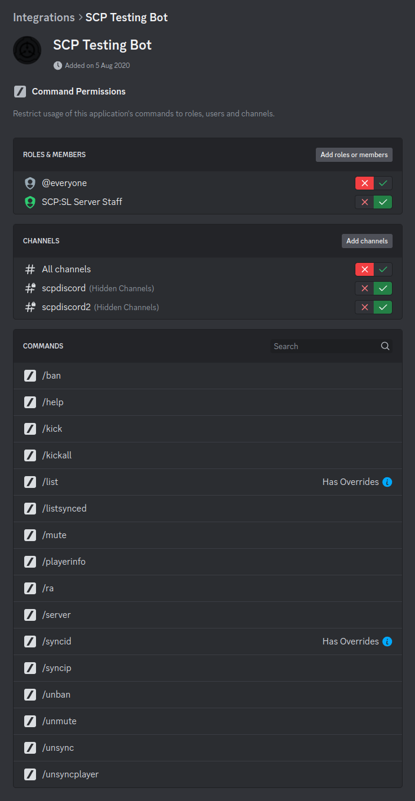

# Installation

----

## 1. Download

Download SCPDiscord, either a [release](https://github.com/KarlOfDuty/SCPDiscord/releases) or [dev build](https://jenkins.karlofduty.com/blue/organizations/jenkins/CI%2FSCPDiscord/activity/).

### **Bot:**

Extract the bot anywhere you wish outside of the server directory.

### **Plugin:**

**Download using the package manager**

`p install KarlOfDuty/SCPDiscord` and restart your server.

**Manual download**
Extract the plugin and dependencies directory into the `PluginAPI/plugins/<port>` directory:
```
plugins/
    <port>/
        dependencies/
            Google.Protobuf.dll
            Newtonsoft.Json.dll
            YamlDotNet.dll
        SCPDiscord.dll
```
## 2. Plugin config

The plugin config is automatically created for you the first time you run the plugin. The path is printed in the server console on startup so you know for sure where it is.

[Click here to view default config](https://github.com/KarlOfDuty/SCPDiscord/blob/master/SCPDiscordPlugin/config.yml)

Remember to set the bot port to something **different from the scpsl server port**, or everything will break.

Remember this port as you will need to put it in the bot config too.

**Note:** Keeping the bot and plugin on different devices is not supported but is possible, you will have to deal with the issues this may result in yourself if you choose to do so.
Simply change the bot ip in the plugin config to correspond with the other device.

----

## 3. Bot setup and config:

### Bot setup:

Set up your bot in the discord control panel according to the guide [here](CreateBot.md).

### Config setup:

[Click here to view default config](https://github.com/KarlOfDuty/SCPDiscord/blob/master/SCPDiscordBot/default_config.yml)

The different options are described in the config. Get Discord IDs by turning on developer mode in Discord and right clicking on a server, role or user.

Run the bot using:
```yaml
# Linux:
./SCPDiscordBot
# Windows
./SCPDiscordBot.exe
```
If you are unable to run the bot make sure the file has correct permissions and try installing dotnet 7.0.

### Command permissions

Make sure to restrict who is allowed to use the bot's commands in your Discord server settings:



If your server uses Steam you should turn off the `/syncip` command and if not you should turn off the `/syncid` command.

You can set more specific permissions for `/server` and `/ra` in the bot config.

----

### If you have followed all the steps you should now have a working Discord bot, otherwise contact me in Discord.

----

# Other important information

**SECURITY WARNING:**

**The bot has no authorization of incoming connections**, this means you cannot allow the plugin's port through your firewall or anyone will be able to send fake messages to it.

If you really need to run the SCP:SL server on one system and the bot on another connected over the internet you can try this:

```bash
sudo ufw allow from 111.111.111.111 to any port 8888
```

This allows only the IP 111.111.111.111 to connect to the bot on port 8888 as long as your default setting is to deny all (which it is by default).

----

**SECURITY WARNING:**

If you ever reveal the bot token to anyone or post it somewhere where it can be read from the internet you need to reset it immediately.
It gives others full access to the bot's Discord account so they can use it to do whatever they want with your Discord server, including deleting it.

It is also highly recommended to make sure the bot only has the necessary Discord permissions and no more in order to limit the damage if you accidentally post your bot token somewhere.

----
